# Архитектурная карта Personal Cabinet Application

**ID**: ac6256dc-5de4-49c8-980c-6a40d776985f  
**Path**: c:/Projects/HorizonProject/aiflows/horizon-community-feat-applications-api-and-test-suite-repair/apps/personal-cabinet

## 🏗️ Общий обзор архитектуры

Personal Cabinet - это веб-приложение для управления личным кабинетом пользователей, построенное с использованием Feature-Sliced Design (FSD) архитектуры. Приложение следует современным принципам разработки React-приложений и обеспечивает четкое разделение ответственности между слоями.

### Технологический стек

```json
{
  "framework": "React 18.2.0",
  "buildTool": "Vite 5.4.19",
  "language": "TypeScript 5.6.3",
  "routing": "React Router Dom 7.6.3",
  "stateManagement": "Zustand 4.5.7 + React Query 5.60.5",
  "ui": "Radix UI + TailwindCSS",
  "forms": "React Hook Form 7.55.0",
  "validation": "Zod 3.24.2",
  "testing": "Jest 30.0.4 + Testing Library",
  "backend": "Supabase",
  "components": "Storybook 9.1.1"
}
```

## 📁 Структура FSD архитектуры

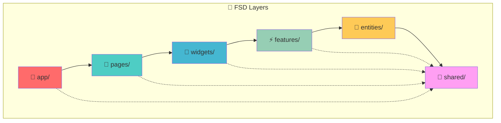

### Слои архитектуры

1. **🚀 app/** - Инициализация приложения, провайдеры, роутинг
2. **📄 pages/** - Страницы приложения (routes)
3. **🧩 widgets/** - Композитные UI блоки
4. **⚡ features/** - Бизнес-фичи приложения
5. **🏢 entities/** - Бизнес-сущности
6. **🔧 shared/** - Переиспользуемый код

## 🔧 Детальная структура компонентов

### 🚀 App Layer
```
app/
├── layouts/
│   └── AdminLayout.tsx          # Макет для административных страниц
├── providers/
│   └── AppProviders.tsx         # Провайдеры приложения
├── router/
│   └── AppRouter.tsx            # Конфигурация роутинга
├── App.tsx                      # Главный компонент приложения
└── App.refactored.tsx          # Рефакторенная версия
```

### 📄 Pages Layer
```
pages/
├── admin/                       # Административные страницы
│   ├── applications/           # Управление заявками
│   ├── documents/              # Управление документами
│   ├── leave-management/       # Управление отпусками
│   ├── roles/                  # Управление ролями
│   ├── tests/                  # Управление тестами
│   ├── users/                  # Управление пользователями
│   └── gallery-moderation.tsx  # Модерация галереи
├── auth/                       # Аутентификация
│   ├── login/
│   └── register/
├── cadet/                      # Курсант
│   ├── test/
│   └── training/
├── dashboard/                  # Дашборд
├── profile/                    # Профиль пользователя
├── settings/                   # Настройки
└── [other pages...]           # Остальные страницы
```

### ⚡ Features Layer
```
features/
├── admin/                      # Административные фичи
│   ├── applications/
│   ├── leave-management/
│   ├── reports/
│   └── tests/
├── auth/                       # Аутентификация
├── dashboard/                  # Дашборд
├── profile/                    # Профиль
├── applications/               # Заявки
├── forum/                      # Форум
├── gallery/                    # Галерея
├── mdt-integration/           # Интеграция с MDT
├── notifications/              # Уведомления
├── test-exam/                 # Экзамены
└── theme/                     # Темы оформления
```

### 🏢 Entities Layer
```
entities/
├── user/                      # Пользователь
├── application/               # Заявка
├── character/                 # Персонаж
├── department/                # Департамент
├── forum/                     # Форум
├── notification/              # Уведомление
├── report/                    # Отчет
├── test/                      # Тест
├── test-result/               # Результат теста
└── test-session/              # Сессия теста
```

### 🔧 Shared Layer
```
shared/
├── api/                       # API клиенты
│   ├── api-client.ts         # Базовый HTTP клиент
│   ├── auth-service.ts       # Сервис аутентификации
│   ├── applications-service.ts # Сервис заявок
│   ├── cabinet-service.ts     # Сервис кабинета
│   ├── public-service.ts      # Публичный сервис
│   ├── user-management.ts     # Управление пользователями
│   └── role-management.ts     # Управление ролями
├── config/                    # Конфигурация
├── contexts/                  # React контексты
├── hooks/                     # Пользовательские хуки
├── lib/                       # Утилиты и библиотеки
├── types/                     # TypeScript типы
└── ui/                        # UI компоненты (58 файлов)
```

## 🌐 Архитектура API

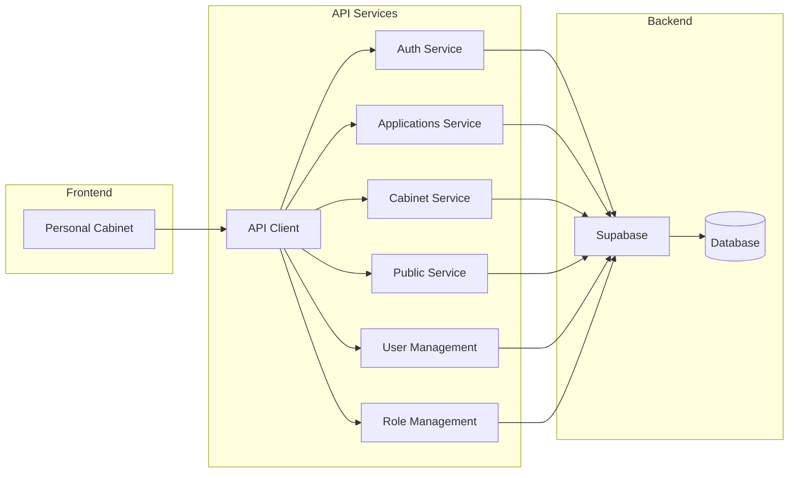

### API Endpoints Structure
- **Auth Service**: Аутентификация и авторизация
- **Applications Service**: Управление заявками
- **Cabinet Service**: Функции личного кабинета
- **Public Service**: Публичные API
- **User Management**: Управление пользователями
- **Role Management**: Управление ролями и правами

## 🔐 Система безопасности и прав доступа

### Permission Guard System
```typescript
// Защита маршрутов по правам
<PermissionGuard permission="admin.panel.access">
  <AdminLayout>
    {/* Административный контент */}
  </AdminLayout>
</PermissionGuard>

// Защита компонентов
<PermissionGuard permission="tests.view">
  <AdminTests />
</PermissionGuard>
```

### Роли и права
- **admin.panel.access** - Доступ к административной панели
- **tests.view** - Просмотр тестов
- **applications.manage** - Управление заявками
- **users.manage** - Управление пользователями
- **gallery.moderate** - Модерация галереи

## 🧪 Архитектура тестирования

```
__tests__/
├── api/
│   └── user-management.test.ts    # Тесты API
└── components/
    ├── approved-message.test.tsx   # Тесты компонентов
    ├── profile-summary-widget.test.tsx
    └── user-table.test.tsx
```

### Стратегия тестирования
- **Unit Tests**: Компоненты, хуки, утилиты
- **Integration Tests**: API сервисы
- **Component Tests**: React компоненты с Testing Library

## 🎨 UI/UX архитектура

### Design System
- **Radix UI** - Базовые примитивы
- **TailwindCSS** - Стилизация
- **Lucide React** - Иконки
- **Framer Motion** - Анимации

### Компоненты (58 UI компонентов)
```
ui/
├── button.tsx               # Кнопки
├── input.tsx               # Поля ввода
├── dialog.tsx              # Модальные окна
├── table.tsx               # Таблицы
├── form.tsx                # Формы
├── toast.tsx               # Уведомления
├── permission-guard.tsx    # Защита по правам
├── error-boundary.tsx      # Обработка ошибок
└── [50+ других компонентов]
```

## 📊 Управление состоянием

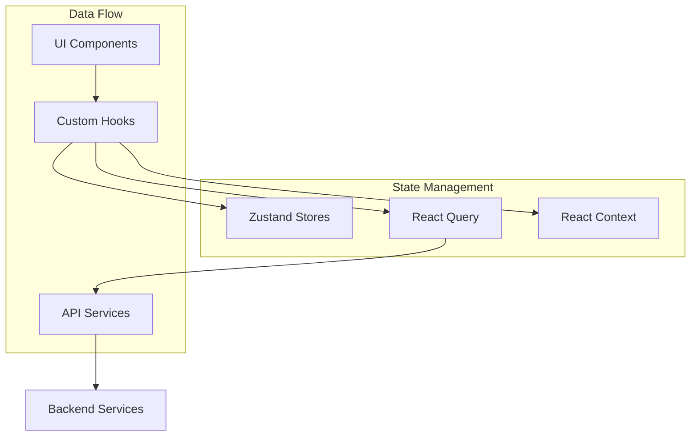

### Паттерны управления состоянием
- **Zustand** - Глобальное состояние приложения
- **React Query** - Кэширование и синхронизация данных с сервером
- **React Context** - Контекстное состояние (темы, аутентификация)
- **Local State** - Локальное состояние компонентов

## 🔄 Жизненный цикл разработки

### Development Workflow
```bash
# Разработка
npm run dev              # Локальный сервер
npm run storybook        # Компоненты в изоляции

# Качество кода
npm run lint             # ESLint проверки
npm run type-check       # TypeScript проверки

# Тестирование
npm run test             # Юнит тесты
npm run test:watch       # Тесты в watch режиме
npm run test:coverage    # Покрытие тестами

# Сборка
npm run build            # Продакшн сборка
npm run preview          # Превью сборки
```

### Code Quality
- **ESLint** - Статический анализ кода
- **TypeScript** - Типизация
- **Prettier** - Форматирование
- **Jest** - Тестирование

## 🚀 Производительность и оптимизация

### Lazy Loading
```typescript
// Страницы загружаются по требованию
const AdminTests = React.lazy(() => import('@/pages/admin/tests'))
const Dashboard = React.lazy(() => import('@/pages/dashboard'))
```

### Bundle Optimization
- **Vite** - Быстрая сборка и HMR
- **Code Splitting** - Разделение кода по маршрутам
- **Tree Shaking** - Удаление неиспользуемого кода
- **Lazy Loading** - Отложенная загрузка компонентов

## 🌍 Интернационализация

```
locales/
├── en.json             # Английский
└── ru.json             # Русский
```

### i18n Stack
- **i18next** - Основная библиотека
- **react-i18next** - React интеграция
- **i18next-browser-languagedetector** - Автоопределение языка

## 📱 Responsive Design

### Breakpoints (TailwindCSS)
- **sm**: 640px и выше
- **md**: 768px и выше
- **lg**: 1024px и выше
- **xl**: 1280px и выше
- **2xl**: 1536px и выше

## 🔧 Конфигурация и окружение

### Build Configuration
```typescript
// vite.config.ts
export default defineConfig({
  plugins: [react()],
  resolve: {
    alias: {
      '@': path.resolve(__dirname, './src'),
    },
  },
})
```

### Environment Variables
```env
VITE_API_URL=          # URL API сервера
VITE_SUPABASE_URL=     # URL Supabase
VITE_SUPABASE_ANON_KEY= # Публичный ключ Supabase
```

## 📈 Метрики и мониторинг

### Performance Monitoring
- **Bundle Analyzer** - Анализ размера бандла
- **Lighthouse** - Веб-витрины
- **React DevTools** - Профилирование компонентов

## 🔗 Интеграции

### External Services
- **Supabase** - Backend as a Service
- **MDT System** - Mobile Data Terminal интеграция
- **FiveM** - Игровой сервер интеграция

## 🚨 Обработка ошибок

```typescript
// Глобальная обработка ошибок
<GlobalErrorBoundary>
  <AppProviders>
    <AppRouter />
  </AppProviders>
</GlobalErrorBoundary>
```

### Error Handling Strategy
- **Error Boundaries** - Перехват ошибок React
- **Try/Catch** - Обработка асинхронных ошибок
- **Toast Notifications** - Уведомления об ошибках
- **Fallback UI** - Резервный интерфейс

## 📝 Ключевые принципы разработки

1. **Separation of Concerns** - Четкое разделение ответственности
2. **DRY (Don't Repeat Yourself)** - Избегание дублирования кода
3. **SOLID Principles** - Принципы объектно-ориентированного дизайна
4. **Component Composition** - Композиция компонентов
5. **Type Safety** - Строгая типизация TypeScript
6. **Performance First** - Приоритет производительности
7. **Accessibility** - Доступность для всех пользователей

## 🔄 Планы развития

### Ближайшие задачи
- [ ] Улучшение тестового покрытия
- [ ] Оптимизация производительности
- [ ] Расширение UI компонентов
- [ ] Добавление PWA возможностей

### Долгосрочные цели
- [ ] Микрофронтенд архитектура
- [ ] Serverless функции
- [ ] Advanced Analytics
- [ ] Real-time collaboration

---

# 🏗️ Архитектурная карта бэкенда Horizon Community

**ID**: ac6256dc-5de4-49c8-980c-6a40d776985f  
**Path**: c:/Projects/HorizonProject/aiflows/horizon-community-feat-applications-api-and-test-suite-repair/apps/server

## Обзор архитектуры бэкенда

Бэкенд представляет собой Node.js приложение на базе Express.js, следующее модульной архитектуре с четким разделением слоев и принципом RLS-first (Row Level Security) для безопасности данных.

## Высокоуровневая архитектура

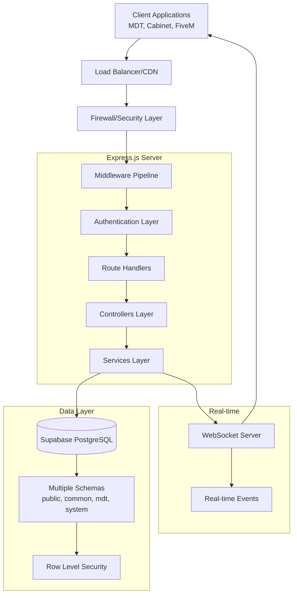

## Структура проекта и компоненты

### 1. Входная точка и инициализация

**Файл:** `src/index.ts`

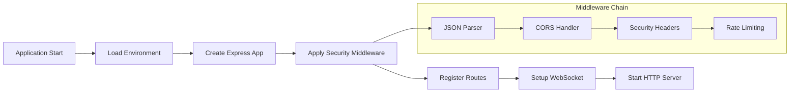

### 2. Архитектура API маршрутов

**Структура маршрутов:**

```mermaid
graph TB
    API[/api] --> Health[/health]
    API --> V1[/v1]
    API --> Admin[/admin]
    
    subgraph "V1 Routes (Public API)"
        V1 --> Auth[/auth - Authentication]
        V1 --> Characters[/characters - Character Management]
        V1 --> Cabinet[/cabinet - Cabinet Operations]
        V1 --> Applications[/applications - Application Management]
        V1 --> Departments[/departments - Department Operations]
        V1 --> Reports[/reports - EMS/FD/Law Reports]
        V1 --> MDT[/mdt - MDT System]
        V1 --> Tests[/test-sessions - Test Management]
        V1 --> Gallery[/gallery - Gallery System]
        V1 --> Common[/common - Common References]
    end
    
    subgraph "Admin Routes"
        Admin --> AdminApps[/applications - Application Management]
        Admin --> Support[/support - Support Tickets]
        Admin --> AdminTests[/tests - Test Administration]
        Admin --> UserMeta[/user-metadata - User Management]
    end
```

### 3. Middleware архитектура

**Файлы:** `src/api/middleware/*`

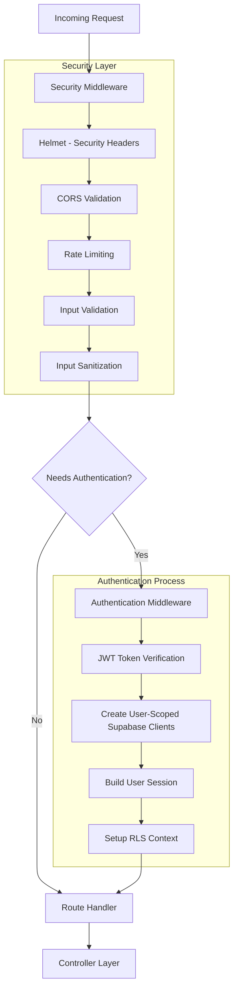

### 4. Слоистая архитектура

**Паттерн:** Routes → Controllers → Services → Data Access

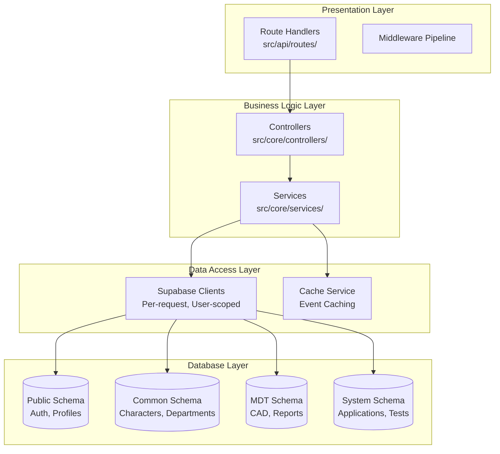

### 5. Сервисы и их назначение

**Директория:** `src/core/services/`

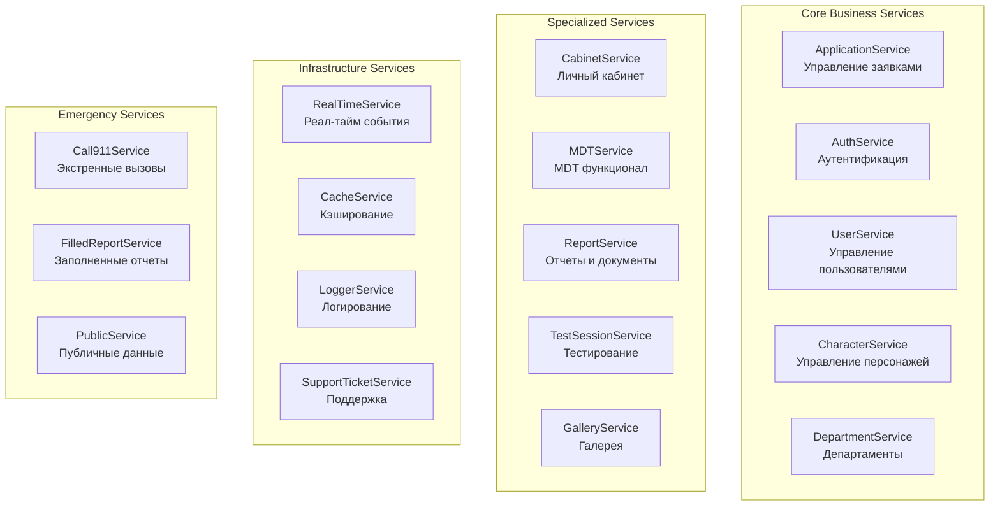

### 6. Система аутентификации и авторизации

**Файл:** `src/api/middleware/auth.middleware.ts`

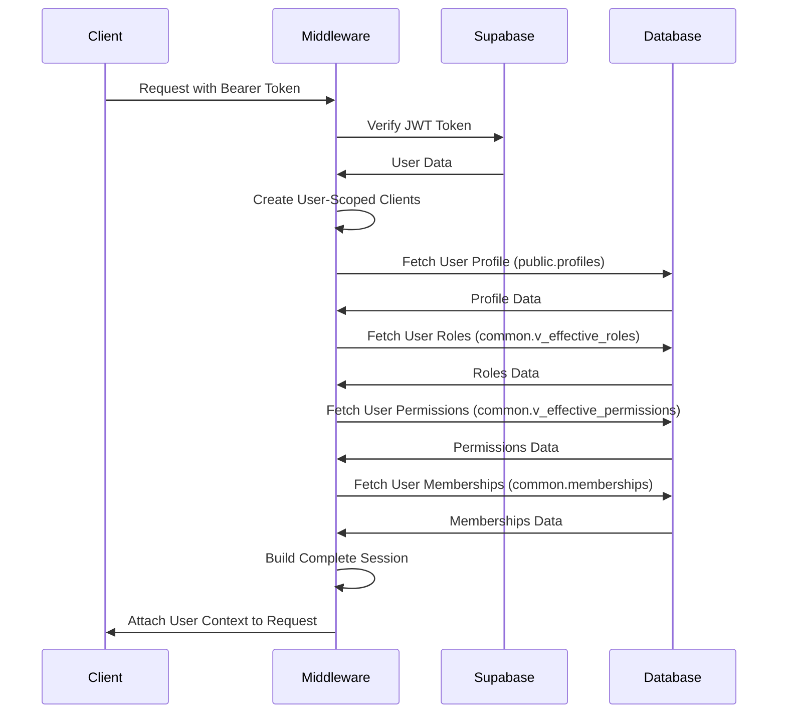

### 7. Схемы базы данных и их назначение

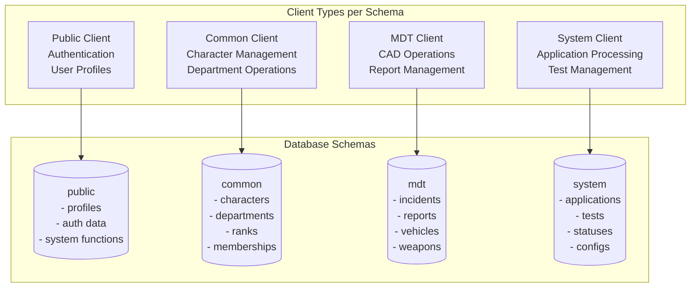

### 8. Реал-тайм коммуникация

**Файлы:** `src/websocket.ts`, `src/core/services/RealTimeService.ts`

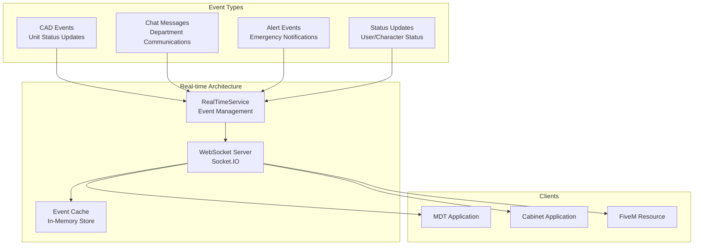

### 9. Система тестирования

**Директория:** `tests/`

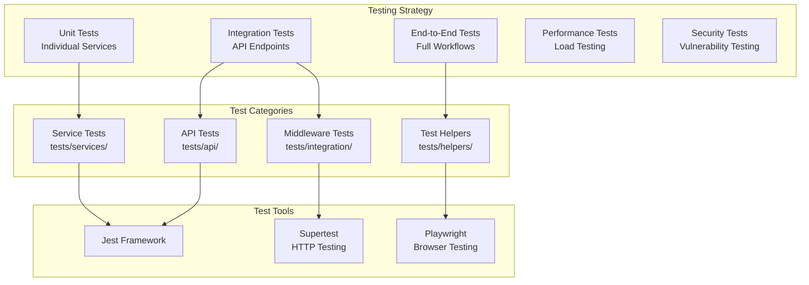

### 10. Обработка ошибок и безопасность

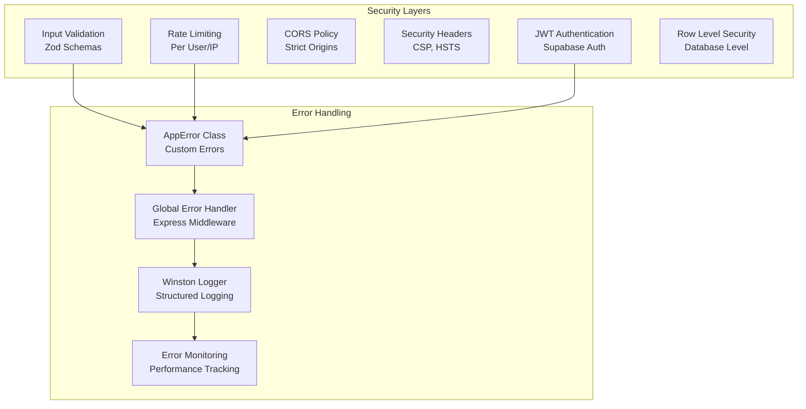

## Технологический стек бэкенда

```json
{
  "runtime": "Node.js 20.16.11",
  "framework": "Express.js 4.21.2",
  "language": "TypeScript 5.6.3",
  "database": "Supabase PostgreSQL",
  "auth": "Supabase Auth + JWT",
  "realtime": "Socket.IO 4.8.1",
  "validation": "Zod 3.25.76",
  "security": "Helmet 8.1.0 + express-rate-limit 8.0.1",
  "testing": "Jest 30.0.4 + Supertest 7.1.3",
  "logging": "Winston 3.15.0",
  "orm": "Drizzle ORM 0.44.3",
  "websockets": "ws 8.18.3",
  "buildTool": "TypeScript Compiler + tsx 4.19.1"
}
```

## Ключевые особенности архитектуры бэкенда

### 1. **RLS-First подход**
- Каждый запрос создает пользовательские Supabase клиенты
- Row Level Security на уровне базы данных
- Автоматическое применение политик безопасности

### 2. **Модульная структура**
- Четкое разделение на слои (Routes → Controllers → Services)
- Dependency Injection для сервисов
- Фабричные функции для создания роутеров

### 3. **Мультисхемная архитектура БД**
- Разделение функциональности по схемам
- Специализированные клиенты для каждой схемы
- Централизованное управление типами

### 4. **Comprehensive Security**
- Многоуровневая система безопасности
- Rate limiting с различными лимитами
- Валидация и санитизация входных данных

### 5. **Real-time capabilities**
- WebSocket сервер для реал-тайм коммуникации
- Event-driven архитектура
- Кэширование событий

### 6. **Extensive Testing**
- Полное покрытие тестами всех слоев
- Автоматизированное тестирование API
- Performance и security тестирование

## Структура файлов бэкенда

```
server/
├── src/
│   ├── api/                     # API Layer
│   │   ├── lib/
│   │   │   └── supabase.ts      # Supabase client configuration
│   │   ├── middleware/          # Express middleware
│   │   │   ├── auth.middleware.ts        # JWT authentication
│   │   │   ├── auth-fixed.middleware.ts  # Fixed auth middleware
│   │   │   ├── logging.middleware.ts     # Request logging
│   │   │   ├── security.middleware.ts    # Security headers, CORS, rate limiting
│   │   │   └── supabase-auth.middleware.ts # Supabase-specific auth
│   │   └── routes/              # API route handlers
│   │       ├── admin/           # Administrative routes
│   │       │   ├── applications.routes.ts
│   │       │   ├── support.routes.ts
│   │       │   ├── tests.routes.ts
│   │       │   └── user-metadata.ts
│   │       ├── v1/              # Public API v1
│   │       │   ├── applications.ts
│   │       │   ├── cabinet.ts
│   │       │   ├── characters.ts
│   │       │   ├── departments.ts
│   │       │   ├── gallery.routes.ts
│   │       │   ├── mdt.ts
│   │       │   └── test-sessions.routes.ts
│   │       ├── auth.ts          # Authentication routes
│   │       ├── forum.ts         # Forum functionality
│   │       ├── realtime.ts      # Real-time communication
│   │       └── index.ts         # Route registration
│   ├── core/                    # Business Logic Layer
│   │   ├── controllers/         # Request handlers
│   │   │   ├── ApplicationController.ts
│   │   │   ├── CabinetController.ts
│   │   │   └── DepartmentController.ts
│   │   ├── lib/
│   │   │   └── supabase.ts      # Core Supabase utilities
│   │   ├── schemas/
│   │   │   └── test.schemas.ts  # Validation schemas
│   │   └── services/            # Business logic services
│   │       ├── ApplicationService.ts    # Application management
│   │       ├── AuthService.ts           # Authentication logic
│   │       ├── CabinetService.ts        # Cabinet functionality
│   │       ├── CharacterService.ts      # Character management
│   │       ├── DepartmentService.ts     # Department operations
│   │       ├── GalleryService.ts        # Gallery management
│   │       ├── LoggerService.ts         # Logging service
│   │       ├── MDTService.ts            # MDT system integration
│   │       ├── RealTimeService.ts       # Real-time events
│   │       ├── ReportService.ts         # Report management
│   │       ├── TestSessionService.ts    # Test session handling
│   │       └── UserService.ts           # User management
│   ├── db/                      # Data Access Layer
│   │   ├── SupabaseStorage.ts   # File storage abstraction
│   │   └── storage.ts           # Storage utilities
│   ├── types/                   # TypeScript type definitions
│   │   ├── express.d.ts         # Express type extensions
│   │   └── services.ts          # Service interfaces
│   ├── utils/                   # Utility functions
│   │   ├── AppError.ts          # Custom error class
│   │   ├── auth.ts              # Authentication utilities
│   │   ├── error-handler.ts     # Global error handling
│   │   └── validation.ts        # Input validation
│   ├── development.ts           # Development environment setup
│   ├── index.ts                 # Application entry point
│   ├── production.ts            # Production environment setup
│   └── websocket.ts             # WebSocket server setup
├── tests/                       # Test Suite
│   ├── api/                     # API endpoint tests
│   │   ├── applications.test.ts
│   │   ├── auth.test.ts
│   │   ├── departments.test.ts
│   │   ├── health.test.ts
│   │   ├── integration.test.ts
│   │   ├── middleware.test.ts
│   │   ├── performance.test.ts
│   │   ├── reports.test.ts
│   │   ├── security.test.ts
│   │   └── websocket.test.ts
│   ├── services/                # Service layer tests
│   │   ├── CabinetService.test.ts
│   │   ├── CharacterService.test.ts
│   │   ├── LoggerService.test.ts
│   │   ├── ReportService.test.ts
│   │   └── UserService.test.ts
│   ├── integration/             # Integration tests
│   │   ├── APIMonitoring.test.ts
│   │   └── Middleware.test.ts
│   ├── helpers/
│   │   └── app-factory.ts       # Test utilities
│   └── setup.ts                 # Test environment setup
├── types/                       # Global type definitions
│   ├── express.d.ts
│   └── normalized-character.types.ts
├── scripts/                     # Utility scripts
│   └── generate-test-report.js
├── jest.config.ts               # Jest testing configuration
├── package.json                 # Dependencies and scripts
├── tsconfig.json                # TypeScript configuration
└── tsconfig.spec.json           # TypeScript test configuration
```

## API Endpoints Overview

### Public API (v1)
- **GET** `/api/v1/health` - Health check
- **POST** `/api/v1/auth/login` - User authentication
- **GET** `/api/v1/characters` - Character management
- **GET** `/api/v1/departments` - Department operations
- **POST** `/api/v1/applications` - Application submission
- **GET** `/api/v1/cabinet/profile` - User profile
- **POST** `/api/v1/test-sessions` - Test session management
- **GET** `/api/v1/gallery` - Gallery access
- **GET** `/api/v1/mdt/*` - MDT system endpoints

### Administrative API
- **GET** `/api/admin/applications` - Application management
- **POST** `/api/admin/tests` - Test administration
- **GET** `/api/admin/support` - Support ticket management
- **PUT** `/api/admin/user-metadata` - User metadata management

## Environment Configuration

```env
# Server Configuration
PORT=5000
NODE_ENV=development|production
HOST=127.0.0.1|0.0.0.0

# Supabase Configuration
SUPABASE_URL=your_supabase_url
SUPABASE_SERVICE_ROLE_KEY=your_service_role_key
SUPABASE_ANON_KEY=your_anon_key

# Security
ALLOWED_ORIGINS=https://app.example.com,https://admin.example.com
CLIENT_URL=http://localhost:3000

# Features
ENABLE_WEBSOCKETS=true
ENABLE_RATE_LIMITING=true
ENABLE_LOGGING=true
```

## Development Commands

```bash
# Development
npm run dev              # Start development server with hot reload
npm run dev:nx           # Start with Nx
npm run check            # TypeScript type checking

# Testing
npm run test             # Run all tests
npm run test:watch       # Run tests in watch mode
npm run test:coverage    # Generate test coverage report
npm run test:api         # Run API tests only
npm run test:security    # Run security tests
npm run test:performance # Run performance tests

# Building
npm run build            # Build for production
npm run build:analyze    # Build with analysis
npm start                # Start production server

# Database
npm run db:reset         # Reset Supabase database
npm run db:migrate       # Apply database migrations
npm run migrate:all      # Apply all migrations

# Code Quality
npm run lint             # ESLint checks
npm run lint:fix         # Auto-fix ESLint issues
```

## Performance Monitoring

### Metrics Collection
- **Response Time** - API endpoint response times
- **Throughput** - Requests per second
- **Error Rate** - Failed request percentage
- **Memory Usage** - Server memory consumption
- **Database Performance** - Query execution times

### Monitoring Tools
- **Winston Logger** - Structured logging
- **Performance Tests** - Load testing with Jest
- **Health Checks** - Endpoint availability monitoring
- **Error Tracking** - Custom error reporting

## Security Implementation

### Multi-layered Security
1. **Network Level** - Firewall, Load Balancer
2. **Application Level** - CORS, Rate Limiting, Input Validation
3. **Authentication** - JWT tokens, Supabase Auth
4. **Authorization** - Row Level Security (RLS)
5. **Data Level** - Input sanitization, SQL injection prevention

### Security Headers
```javascript
// Implemented via Helmet middleware
{
  contentSecurityPolicy: {
    directives: {
      defaultSrc: ["'self'"],
      styleSrc: ["'self'", "'unsafe-inline'"],
      scriptSrc: ["'self'"],
      imgSrc: ["'self'", "data:", "https:"],
      connectSrc: ["'self'"],
      fontSrc: ["'self'"],
      objectSrc: ["'none'"],
      mediaSrc: ["'self'"],
      frameSrc: ["'none'"]
    }
  },
  hsts: {
    maxAge: 31536000,
    includeSubDomains: true,
    preload: true
  }
}
```

Эта архитектура обеспечивает масштабируемость, безопасность и поддерживаемость для комплексной системы управления ролевыми играми с множественными клиентскими приложениями.

---

**Последнее обновление**: 2024-08-23  
**Версия документа**: 2.0.0 (добавлена архитектура бэкенда)  
**Контакт**: Qoder AI Assistant