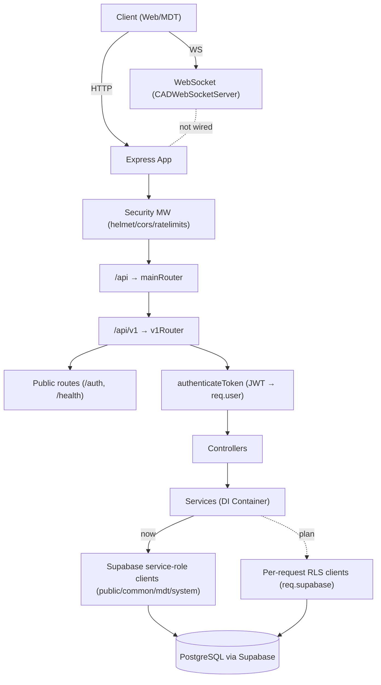

# Архитектура бэкенда (текущая стабилизированная версия)

Документ описывает фактическое состояние архитектуры бэкенда в `apps/server` после рефакторинга. Он предназначен как единый источник истины для разработки, онбординга и принятия решений.

## 1. Обзор проекта и точка входа

Основная точка входа сервера — `apps/server/src/index.ts`. Здесь создается Express-приложение, формируется DI-контейнер сервисов и регистрируются маршруты. Запуск производится на порту `5000` (не изменять порты).

Ключевые фрагменты:

```ts
// apps/server/src/index.ts
const app: import('express').Express = express();

// Базовые middleware
app.use(express.json());
app.use(express.urlencoded({ extended: true }));
app.use(cors({ origin: "*", methods: ["GET","POST","PUT","DELETE","OPTIONS"], ... }));

// Инициализация сервисов (DI-контейнера)
const services: ServicesContainer = { /* authService, characterService, ... */ };

// Регистрация роутов (возвращает HttpServer)
const server = await registerRoutes(app, services);

// Dev: Vite, Prod: статика
if (process.env.NODE_ENV === "development") { await setupVite(app, server); } else { serveStatic(app); }

// Запуск
server.listen({ port, host }, () => { log(`serving on ${host}:${port}`); });
```

DI-контейнер формируется локально в `index.ts` путём инстанцирования всех сервисов и передачи их в `registerRoutes(app, services)`.

## 2. Жизненный цикл запроса и middleware

- Входящий HTTP-запрос проходит через базовые 
  - `express.json()` и `express.urlencoded()`;
  - CORS (глобально в `index.ts` разрешён `origin: "*"`).
- Регистрация маршрутов происходит в `registerRoutes`, где вешается `app.use('/api', mainRouter)` и далее `mainRouter.use('/v1', v1Router)`.
- Внутри `v1` после публичных роутов применяется `authenticateToken` — все защищённые эндпоинты требуют валидный JWT.

### CORS и безопасность

Существует модуль безопасности `apps/server/src/api/middleware/security.middleware.ts`, в котором определены:
- rate-limiter'ы (`apiRateLimiter`, `authRateLimiter`, `boloCreateRateLimiter`),
- опции `corsOptions`,
- конфигурация `helmetConfig`,
- комбинированные наборы: `securityMiddleware`, `authSecurityMiddleware`, `boloSecurityMiddleware`.

Фактическое состояние: на уровне точки входа применяется упрощённый CORS из `index.ts`. `securityMiddleware` (Helmet, строгий CORS, лимитеры, санитизация) пока не интегрирован глобально. Это отмечено как технический долг (см. раздел 8).

### Аутентификация

Основной middleware аутентификации: `apps/server/src/api/middleware/auth.middleware.ts` (`authenticateToken`).

Ключевые моменты:
- Извлекает JWT из `Authorization: Bearer <token>`.
- Валидирует токен через `supabase.auth.getUser(token)`.
- Получает профиль пользователя из `public.profiles` и формирует `req.user` (id, email, username, role, user_metadata).
- Дополнительные проверки: `requireRole`, `requireAnyRole`, `authenticateCadToken`, `authenticateApiToken`, `requireCharacter` и комбинированные наборы.

Важно: на текущий момент middleware НЕ создаёт пер-запросные RLS-клиенты Supabase и НЕ присваивает `req.supabase`. Используются глобальные клиенты (service-role) из `core/lib/supabase`. Это отклонение от целевой модели «RLS-first» и зафиксировано как технический долг (см. раздел 8).

## 3. Роутинг и контроллеры

Топ-уровень роутинга:

```ts
// apps/server/src/api/routes/index.ts
const mainRouter: Router = Router();
mainRouter.get('/health', (req, res) => res.status(200).json({ status: 'UP' }));
const v1Router = createV1Router(services);
mainRouter.use('/v1', v1Router);
app.use('/api', mainRouter);
```

Структура `v1`:
- Публичные роуты: `/auth` (регистрация/логин/verify), `/health`.
- После этого: `router.use(authenticateToken)` — все дальнейшие `v1`-роуты защищены JWT.
- Модуляризация:
  - `v1/characters.ts` — персонажи;
  - `v1/applications.ts` — заявки;
  - `v1/cabinet.ts` — личный кабинет;
  - `v1/departments.ts` — департаменты;
  - `v1/test-sessions.routes.ts` — сессии тестов;
  - `admin/` — админ-маршруты (support, user-metadata, tests);
  - временные группы-заглушки: `report-templates`, `ems-fd-reports`, `law-reports`, `discord`, `forum`, `realtime` (возвращают health).

Контроллеры — тонкий слой между http и сервисами. Пример:

```ts
// apps/server/src/core/controllers/ApplicationController.ts
async createApplication(req: Request, res: Response, next: NextFunction) {
  const userId = req.user.id; // формируется в authenticateToken
  const characterId = req.user.characterId; // предполагается в токене
  // проверка лимитов, вызов applicationService, возврат результата
}
```

## 4. Слой доступа к данным (Supabase)

### Глобальные клиенты (service-role)

Определены в `apps/server/src/core/lib/supabase.ts`:
- `supabase` (public), `commonSupabase` (common), `mdtSupabase` (mdt), `systemSupabase` (system) — все создаются через сервисный ключ (`SUPABASE_SERVICE_ROLE_KEY`).
- Предназначены для системных/админских операций без привязки к правам конкретного пользователя.

```ts
// apps/server/src/core/lib/supabase.ts
export const supabase = createClient<Database>(SUPABASE_URL, SERVICE_KEY);
export const commonSupabase = createClient<Database,'common'>(..., { db: { schema: 'common' } });
export const mdtSupabase = createClient<Database,'mdt'>(..., { db: { schema: 'mdt' } });
export const systemSupabase = createClient<Database,'system'>(..., { db: { schema: 'system' } });
```

### Пер-запросные RLS-клиенты (целевое состояние)

В кодовой базе есть фабрика `apps/server/src/api/lib/supabase.ts` (`createSupabaseClient(schema)`), однако на данный момент middleware аутентификации не создаёт и не прикрепляет `req.supabase` с токеном пользователя. Фактическое использование — глобальные клиенты из `core/lib/supabase`. Это требует доработки (см. раздел 8) для соблюдения «RLS-first» стратегии.

## 5. Сервисный слой и DI-контейнер

- Контейнер сервисов: `apps/server/src/types/services.ts` (`ServicesContainer`).
- Создание экземпляров сервисов и наполнение контейнера происходит в `index.ts`, после чего контейнер передаётся в роутеры.
- Сервисы инкапсулируют бизнес-логику, доступ к данным и валидацию доменных правил.

Сервис-карта (краткие ответственности):
- `AuthService`: регистрация/логин, операции с пользователями (использует спец. admin-клиент для `auth.admin`).
- `CharacterService`: CRUD по `common.characters` и связанным операциям владения.
- `ApplicationService`: управление заявками в `system.applications` (создание, обновление статуса, выборки).
- `TestAdminService`: админ-управление тестами, вопросами, опциями (строго типизированные операции под новую схему).
- `TestSessionService`: управление сессиями прохождения тестов (старт, фиксация потери фокуса, отправка ответов).
- `MDTService`: IC-кампус (BOLO, отчёты и т.п.; в процессе интеграции с новой схемой).
- `ReportService`: операции с отчётами (интеграция со схемой `mdt`).
- `ReportTemplateService`: заглушка — методы не реализованы.
- `FilledReportService`: заготовка под `filled_reports` (ожидает регенерацию типов; методы ещё не добавлены).
- `SupportTicketService`: временно отключён (таблица отсутствует); операции возвращают `501`.
- `Call911Service`: доменная логика по вызовам 9-1-1.
- `PublicService`: публичные данные (например, список департаментов для лендингов/портала).
- `DepartmentService`: операции по департаментам и членам департаментов.
- `LoggerService`, `CacheService`, `RealTimeService`, `CabinetService`: инфраструктурные и агрегирующие сервисы, используемые в кабинетных и внутренних сценариях.

## 6. Карта API-эндпоинтов (основные)

Группировка по функциональности (`/api/v1/...`):

- Auth (`v1/index.ts` → `auth.ts`):
  - `POST /auth/register`
  - `POST /auth/login`
  - `POST /auth/verify`
  - `GET /auth/me` (защищено JWT)
  - `POST /auth/logout` (защищено JWT)

- Characters (`v1/characters.ts`):
  - `POST /characters` (создать персонажа; проверка владения `user_id`)
  - `GET /characters/my` (все персонажи текущего пользователя)
  - `GET /characters/:id`
  - `PUT /characters/:id`
  - `DELETE /characters/:id`
  - Примечание: профили LEO/EMS — временно закомментированы до появления схем.

- Applications (`v1/applications.ts` + `ApplicationController`):
  - `POST /applications` (создать заявку, лимит 3/мес.)
  - `GET /applications/:id`
  - `PUT /applications/:id/status`
  - `POST /applications/:id/test-session` (создать сессию теста по заявке)

- Cabinet (`v1/cabinet.ts` + `CabinetController`):
  - `GET /cabinet/dashboard-data`
  - `GET /cabinet/profile`
  - `PUT /cabinet/profile`
  - `GET /cabinet/character`
  - `GET /cabinet/applications`
  - `GET /cabinet/reports`
  - `GET /cabinet/departments`
  - `GET /cabinet/settings`
  - `PUT /cabinet/settings`
  - Дополнительно: общий `GET /dashboard-data` (защищённый) в корне `v1`.

- Departments (`v1/departments.ts` + `DepartmentController`):
  - `GET /departments`
  - `GET /departments/:id`
  - `GET /departments/:id/members`
  - `POST /departments` (только admin)
  - `PUT /departments/:id` (только admin)
  - `DELETE /departments/:id` (только admin)

- Test Sessions (`v1/test-sessions.routes.ts`):
  - `POST /test-sessions` (старт сессии)
  - `POST /test-sessions/:id/focus-loss`
  - `POST /test-sessions/:id/submit`

- Admin (`v1/admin/index.ts`):
  - подгруппы: `/support`, `/user-metadata`, `/tests` (см. маршруты внутри соответствующих файлов).

- Health:
  - `GET /api/health` (корневой mainRouter)
  - `GET /api/v1/health`
  - Временные здоровьесигналы для заглушечных групп: `/report-templates`, `/ems-fd-reports`, `/law-reports`, `/discord`, `/forum`, `/realtime`.

## 7. WebSocket-слой

Реализация — `apps/server/src/websocket.ts`.

- Сервер: `CADWebSocketServer` (на `ws`) с поддержкой подписок на каналы, ping/pong, трансляцией событий, базовой аутентификацией сообщения.
- Вспомогательные функции: `getDefaultPermissions`, маппинг `WEBSOCKET_EVENTS → WEBSOCKET_CHANNELS`.
- Экспортируются хелперы: `initializeCADWebSocket(server)`, `getCADWebSocket()`.

Фактическое состояние: инициализация WebSocket-сервера в `index.ts` не выполняется. `registerRoutes` возвращает `HttpServer`, но `initializeCADWebSocket(server)` не вызывается. Подключение WS следует выполнять отдельно (см. раздел 8).

## 8. Технический долг и TODO

- Безопасность:
  - `security.middleware.ts` (Helmet, строгий CORS, лимитеры) подготовлен, но не интегрирован глобально в `index.ts`. Сейчас применяется либеральный CORS (`origin: "*"`).
  - Рекомендуется подключить `securityMiddleware` до регистрации роутов и добавить специализированные наборы (`authSecurityMiddleware`, `boloSecurityMiddleware`) на соответствующие группы.

- Аутентификация и RLS:
  - `authenticateToken` не создает пер-запросные Supabase клиенты (`req.supabase`) с пользовательским токеном и не реализует «RLS-first» доступ. Фактически в коде преобладают глобальные клиенты `service-role`.
  - Рекомендуется в `authenticateToken` (после верификации) сформировать `req.supabase = { public, common, mdt, system }` с `global: { headers: { Authorization: `Bearer ${token}` } }` или эквивалентом из SDK, и перейти на эти клиенты в сервисах.

- Заглушки/временные отключения:
  - `SupportTicketService` — бросает `501` для записывающих операций, чтения возвращают пустые коллекции.
  - `ReportTemplateService` — все методы «не реализованы».
  - Роуты LEO/EMS профилей в `characters` — закомментированы до появления таблиц в схеме.
  - В `v1/index.ts` — группы `/report-templates`, `/ems-fd-reports`, `/law-reports`, `/discord`, `/forum`, `/realtime`: пока возвращают `health`.

- Консистентность DI:
  - `v1/test-sessions.routes.ts` создаёт `new TestSessionService()` внутри модуля, минуя DI-контейнер. Для единообразия стоит использовать `services.testSessionService` из `ServicesContainer`.

- Инициализация WebSocket:
  - `initializeCADWebSocket(server)` не вызывается. Добавить инициализацию после `registerRoutes`.

- Типы БД:
  - `FilledReportService` помечает TODO о регенерации типов для `filled_reports`.
  - `systemSupabase` отмечен как использующий типы схемы, появляющиеся после регенерации.

## 9. Диаграмма (Mermaid)



---

## Приложение: подтверждающие фрагменты

- Точка входа и DI:

```1:20:apps/server/src/index.ts
import express, { type Request, type Response, type NextFunction } from "express";
import cors from "cors";
import { registerRoutes } from "./api/routes";
...
const app: import('express').Express = express();

// Middleware
app.use(express.json());
app.use(express.urlencoded({ extended: true }));

// CORS - стандартная реализация
app.use(cors({ origin: "*", methods: ["GET", "POST", "PUT", "DELETE", "OPTIONS"], ... }));
```

```87:110:apps/server/src/index.ts
const services: ServicesContainer = { ... };
const server = await registerRoutes(app, services);
...
if (process.env.NODE_ENV === "development") { const { setupVite } = await import("./development"); await setupVite(app, server); } else { serveStatic(app); }
```

- Регистрация `/api` и `/api/v1`:

```17:36:apps/server/src/api/routes/index.ts
export async function registerRoutes(app: Express, services: ServicesContainer): Promise<HttpServer> {
  const server = createServer(app);
  ...
  const v1Router = createV1Router(services);
  mainRouter.use('/v1', v1Router);
  app.use('/api', mainRouter);
}
```

- Публичные/защищенные роуты и «охранник»:

```62:84:apps/server/src/api/routes/v1/index.ts
export function createV1Router(services: ServicesContainer): Router {
  ...
  router.use('/auth', createAuthRoutes(services));
  router.get('/health', ...);
  router.use(authenticateToken); // все, что ниже — только с JWT
  ...
}
```

- Аутентификация (JWT → req.user):

```71:139:apps/server/src/api/middleware/auth.middleware.ts
export async function authenticateToken(req: Request, res: Response, next: NextFunction) {
  const authHeader = req.headers.authorization;
  const token = authHeader && authHeader.split(' ')[1];
  const { data: { user }, error } = await supabase.auth.getUser(token);
  ...
  (req as AuthenticatedRequest).user = authenticatedUser;
  next();
}
```

- Пример контроллера как тонкого слоя:

```12:23:apps/server/src/core/controllers/ApplicationController.ts
async createApplication(req: Request, res: Response, next: NextFunction) {
  const userId = req.user.id;
  const characterId = req.user.characterId;
  ...
}
```

- Пример модульных роутов (applications):

```31:44:apps/server/src/api/routes/v1/applications.ts
router.post('/', validateRequest({ body: createApplicationBodySchema }), (req, res, next) => applicationController.createApplication(req, res, next));
```

- Пример `service-role` клиентов:

```17:36:apps/server/src/core/lib/supabase.ts
export const supabase = createClient<Database>(supabaseUrl, supabaseServiceKey, {...});
export const commonSupabase = createClient<Database,'common'>(..., { db: { schema: 'common' } });
export const mdtSupabase = createClient<Database,'mdt'>(..., { db: { schema: 'mdt' } });
export const systemSupabase = createClient<Database,'system'>(..., { db: { schema: 'system' } });
```

- WebSocket реализация:

```756:763:apps/server/src/websocket.ts
export function initializeCADWebSocket(server: any): CADWebSocketServer {
  if (cadWebSocketServer) { cadWebSocketServer.stop(); }
  cadWebSocketServer = new CADWebSocketServer(server);
  return cadWebSocketServer;
}
```

---

## Критические замечания по безопасности и архитектуре

- До интеграции `securityMiddleware` фактическая поверхность безопасности — упрощённый CORS; RPS-ограничения отсутствуют глобально.
- Преобладание `service-role` клиентов повышает риски нарушения RLS-инвариантов. Приоритет — перейти на «RLS-first» с пер-запросными клиентами, а `service-role` оставить только для строго необходимых системных операций.
- Выравнивание DI (убрать локальные `new Service()` из роутов) повысит тестируемость и предсказуемость.
- Инициализировать WebSocket сервер контролируемо (любой доступ — только после JWT/роль-проверок и явных подписок).

